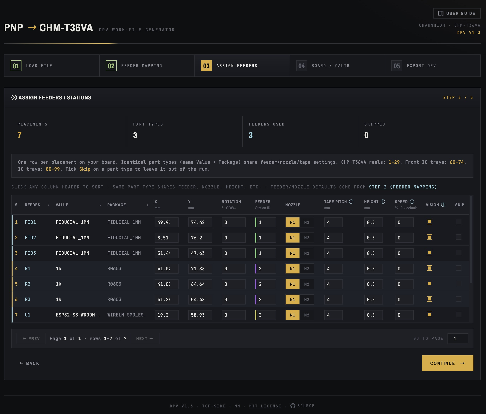

# PnP → Charmhigh CHM-T36VA DPV Converter

A free, browser-based tool that converts PCB pick-and-place files into `.dpv` work files for the Charmhigh CHM-T36VA pick-and-place machine. Supports Fusion 360, EAGLE, KiCad, and EasyEDA out of the box.

**Live:** [geocentricllc.github.io/chm-t36va](https://geocentricllc.github.io/chm-t36va/)



<!-- Replace screenshot.png with a capture of the app — Step 3 (Assign Feeders) with the demo data loaded shows the most visually interesting view. Recommended size: 1600px wide. -->

Runs entirely in your browser. No uploads, no install, no telemetry. Save the page to disk and use it offline.

---

## Table of contents

- [What this is for](#what-this-is-for)
- [Quick start](#quick-start)
- [Supported input files](#supported-input-files)
  - [`.mnt` / `.mnb` from Fusion 360 or EAGLE](#mnt--mnb-from-fusion-360-or-eagle)
  - [KiCad `.pos` files](#kicad-pos-files)
  - [EasyEDA pick-and-place CSV](#easyeda-pick-and-place-csv)
  - [Generic CSV / TXT](#generic-csv--txt)
  - [Coordinate units](#coordinate-units)
- [The 5-step workflow](#the-5-step-workflow)
  - [Step 1 — Load file](#step-1--load-file)
  - [Step 2 — Feeder mapping](#step-2--feeder-mapping)
  - [Step 3 — Assign feeders](#step-3--assign-feeders)
  - [Step 4 — Board / calibration](#step-4--board--calibration)
  - [Step 5 — Export DPV](#step-5--export-dpv)
- [CHM-T36VA reference](#chm-t36va-reference)
  - [Station ID ranges](#station-id-ranges)
  - [Nozzle selection](#nozzle-selection)
  - [Tape pitch reference](#tape-pitch-reference)
- [Saving and reusing feeder configs](#saving-and-reusing-feeder-configs)
- [Common questions](#common-questions)
- [Troubleshooting](#troubleshooting)
- [Privacy](#privacy)
- [License](#license)

---

## What this is for

The Charmhigh CHM-T36VA expects pick-and-place data in its proprietary `.dpv` format — a plain-text file with sections for stations (feeders), placements, fiducials, and calibration. PCB CAD tools export pick-and-place data in a variety of other formats: `.mnt` from Fusion 360 / EAGLE's `mountsmd.ulp`, `.pos` from KiCad, tab-separated CSV from EasyEDA, generic CSV from various CAM processors.

This converter bridges the gap. Drop your CAD output in, optionally pick which physical feeder reels hold which parts, set a board offset and fiducials, and download a `.dpv` ready to load on the machine.

It's designed for hobbyists and small-shop assemblers running the CHM-T36VA — the same audience the machine itself targets. Everything happens locally in your browser, so it works offline and your design files never leave your computer.

---

## Quick start

1. Open the [live site](https://geocentricllc.github.io/chm-t36va/), or download `index.html` and open it in any modern browser.
2. **Step 1:** drop your PnP file (`.mnt`, `.mnb`, `.pos`, `.csv`, or `.txt`) onto the dropzone. Or click **Load demo data** to walk through the workflow with a synthetic board (5 components plus 3 fiducials).
3. **Step 2 (optional):** for each unique part type, pick a Feeder ID and Nozzle. Save the mapping to JSON to reuse on future boards.
4. **Step 3:** review per-placement settings. Tweak feeder assignments, nozzle, tape pitch, height, etc. Skip individual placements you don't want placed.
5. **Step 4:** set the board X/Y offset if needed. The fiducial dropdowns auto-detect `FID*`-named refs (or fall back to scanning the Value/Package fields for parts whose type starts with "FID").
6. **Step 5:** review the DPV preview, click Download. Copy the `.dpv` to a USB stick and load on the CHM-T36VA. Calibrate fiducials at the machine before running.

---

## Supported input files

### `.mnt` / `.mnb` from Fusion 360 or EAGLE

The `.mnt` / `.mnb` format comes from EAGLE's classic `mountsmd.ulp` script, which both EAGLE and Fusion 360's Electronics workspace ship with.

**Generate it via:**
- **Fusion 360 (Electronics):** *Utilities → Automate → Run ULP → mountsmd.ulp*
- **EAGLE:** *File → Run ULP → mountsmd.ulp* from the board editor

The script writes one file per side: `.mnt` = top, `.mnb` = bottom. Column layout is fixed:

```
RefDes  LocationX  LocationY  Rotation  Value  Package
```

Whitespace-delimited, no header row. The converter recognizes the extension and parses without column-mapping.

> ⚠ **Don't confuse with Manufacturing → Outputs → Pick and Place.** Fusion 360 has a separate Manufacturing-workspace pick-and-place generator, but it omits the Package column — that file is incomplete for this converter's nozzle/tape-pitch defaults. Always use the `mountsmd.ulp` path.

### KiCad `.pos` files

**Generate it via:** *File → Fabrication Outputs → Component Placement (.pos) File* in the PCB Editor.

Both KiCad output formats are supported:

- **CSV format** (`.csv`) — comma-separated with headers `Ref,Val,Package,PosX,PosY,Rot,Side`. Recommended for new projects.
- **Plain Text / ASCII format** (`.pos`) — whitespace-aligned columns with metadata header lines (`### Module positions`, `## Unit = mm`) and a `#`-prefixed column header. The converter recognizes this format and parses it directly.

Use **millimeters** as the unit. Set the board origin via *Place → Drill/Place File Origin* at the lower-left corner of your board before exporting — otherwise placements will be relative to the page origin (typically far off the board) and you'll need a large X/Y offset on Step 4 to compensate.

### EasyEDA pick-and-place CSV

**Generate it via:** *File → Export → Pick and Place File* (Std edition: *Top Menu → Fabrication → Pick and Place File*).

EasyEDA writes UTF-8 with a BOM and tab delimiters — both are handled transparently. The `Mid X` / `Mid Y` columns are used as placement coords; the additional `Ref X/Y` and `Pad X/Y` columns are ignored (they reference the part's library origin, not the placed centroid).

### Generic CSV / TXT

Any comma/tab/semicolon-delimited file with a header row works. Column detection is case-insensitive and scans for these names:

| Field | Recognized header names | Required |
|---|---|---|
| Reference | Designator, RefDes, Reference, Ref, Name, Part, Component | Yes |
| Value | Value, Val, Comment, Description | No |
| Package | Package, Footprint, Pattern, Pkg | No |
| X coord | Mid X, X, Center X, Loc X, Pos X, PosX, Ref X | Yes |
| Y coord | Mid Y, Y, Center Y, Loc Y, Pos Y, PosY, Ref Y | Yes |
| Rotation | Rotation, Rot, Angle, Orientation, Theta | Yes |
| Side | Side, Layer, TB, Mirror | No |
| DNP | DNP, DNI, Do Not Place / Populate / Install, Populate | No |

The override dropdowns on Step 1 let you correct the auto-detection if the heuristic gets units, side, or DNP wrong.

### Coordinate units

Auto-detected from the magnitude of X/Y values:

- Max coordinate < 13 → **inches**
- Max coordinate ≤ 300 → **millimeters**
- Max coordinate > 300 → **mils** (1/1000 inch)

The override dropdown lets you correct this for unusual cases.

---

## The 5-step workflow

### Step 1 — Load file

Drop or click to browse. After parsing, you'll see file stats and a one-line summary of which columns mapped to what. For most files, just hit **Continue**.

Touch the override dropdowns when:

- The unit auto-detection picked wrong (a tiny mil-units board misread as mm)
- You want to include both top and bottom parts — change Side filter to "All rows"
- You want to include parts marked DNP — set DNP filter to "Include them"

Step 1 also has a **Load demo data** button that injects a small synthetic board (5 components plus 3 fiducials) so you can preview the entire workflow without a real file.

### Step 2 — Feeder mapping

A table with one row per **unique Value+Package** pair. For each, you can optionally set:

- **Feeder ID** (1–99): which station on your machine holds that reel
- **Nozzle** (N1, N2, or `—` for auto): which nozzle picks this part type

Inputs are blank by default — leave them blank to skip a row. Unmapped rows get auto-assigned defaults on Step 3.

The Feeder ID input has a **color-coded left edge** so you can see at a glance which entries share a feeder number.

The table **paginates at 20 rows per page** for large projects. Editing a row on a non-first page commits the change in place without resetting your position.

**Why this step exists:** most physical reels stay in the same station across multiple boards. Once you've loaded a reel of `10k 0402` at station 5, every future board with that part should use station 5. Save the mapping once, reuse it on every subsequent board.

The toolbar above the table has three buttons:

- **↓ Save config** writes a JSON file with only the rows you've filled in (blank rows are not stored)
- **↑ Load config** applies a saved JSON to the current board's mapping table; case-insensitive Value+Package matching means a config saved from board A's `10K` will match board B's `10k`
- **Clear all** wipes the current mapping (useful before loading a different config from scratch)

### Step 3 — Assign feeders

The main editing screen. **One row per placement** on your board. Identical part types share most settings — editing them on one row updates every row of that type, with sibling inputs visually synced.

Column behavior:

| Column | Per-placement | Per-part-type (shared) |
|---|---|---|
| RefDes, Value, Package | display only | — |
| X / Y / Rotation | ✓ editable | — |
| **Skip** | ✓ editable | — |
| Feeder | — | ✓ editable |
| Nozzle (N1/N2 toggle) | — | ✓ editable |
| Tape pitch | — | ✓ editable |
| Height | — | ✓ editable |
| Speed | — | ✓ editable |
| Vision | — | ✓ editable |

The **Feeder column has color-coded left edges** — same color = same feeder ID, computed from a golden-angle hue formula so even adjacent IDs are visually distinct. Quick visual sanity check that your reel assignments are right.

**Sort:** click RefDes, Value, or Package column headers. X/Y/Rotation aren't sortable. Click a sortable header again to reverse, third time to return to insertion order. RefDes uses natural sort (R1 < R2 < R10).

**Skip behavior:** ticking Skip on a row immediately moves it to the end of the table. Skipped rows always partition to the tail regardless of sort. Skip is per-placement, so ticking it on R1 doesn't affect R2.

**Pagination:** the table shows 20 rows per page. Sorting always jumps to page 1 so the top of the new ordering is visible.

**Defaults:** feeder/nozzle come from your Step 2 mapping if set; otherwise auto-assigned. The auto-assigner skips feeder IDs claimed by mappings, so you don't get accidental collisions. Tape pitch, height, and nozzle (when not mapped) are guessed from the package name.

### Step 4 — Board / calibration

Set the **X/Y offset** if your file's origin isn't the PCB's lower-left corner. Most modern CAD tools export with the lower-left convention, so X/Y offsets of `(0, 0)` work in most cases. You'll need to adjust when:

- Your CAD design uses board-center origin
- Negative X or Y values appear in the placements
- You're panelizing into a larger panel coordinate system
- You're using KiCad without setting *Place → Drill/Place File Origin*

**Quick test:** after Step 3 the table displays raw placement coords. If smallest X/Y values are near zero — good. If they're at, say, X = −18 to +18 — the file uses centered origin and you need ~+18mm offset.

**Fiducial dropdowns:** each of UL (upper-left), LR (lower-right), and LL (lower-left) has a dropdown listing every RefDes plus `(none)` and `(custom)`. Selecting a RefDes auto-fills X/Y from that placement (with the X/Y offset already applied). `(custom)` enables manual entry. `(none)` zeroes the slot.

**Auto-detection** — the converter pre-selects fiducials in this priority order:

1. RefDes pattern: any placement matching `FID1`/`FID2`/`FID3`, `MARK1`/`MARK2`/`MARK3`, or `F1`/`F2`/`F3`
2. Fallback: if no RefDes matches, any placement whose **Value** or **Package** starts with `FID` (case-insensitive — catches `FIDUCIAL`, `fid-1mm`, `FID-2MM`, etc.)

When auto-detected, each card shows a small **`auto-detected`** badge next to its label until you change the selection manually. Going back to other steps preserves your selections.

> Calibrating on the machine is still standard practice. Even with fiducial coords set in the DPV, you'll typically jog the camera to each physical mark at the machine, which writes the actual position. The DPV's fiducial values are a starting hint, not the final word.

### Step 5 — Export DPV

The DPV preview shows exactly what will be written. Filename is editable. Download saves a plain-text `.dpv` file ready to copy to a USB stick.

---

## CHM-T36VA reference

### Station ID ranges

| Range | Type | Notes |
|---|---|---|
| 1–29 | Reel feeders | Standard SMD tape reels — most parts go here |
| 30–59 | — | Not used / reserved |
| 60–74 | Front IC trays | Tubed ICs and small trays at the front |
| 75–79 | — | Not used / reserved |
| 80–99 | IC trays | Matrix-tray ICs (waffle pack) |

The converter accepts any value 1–99. The duplicate-feeder warning at Step 3 → Step 4 catches collisions before you generate the DPV.

### Nozzle selection

The CHM-T36VA has two nozzles mounted side by side:

- **N1 (left)** — typically a smaller nozzle for 0201, 0402, 0603, SOT-23. Default for passives.
- **N2 (right)** — typically a larger nozzle for SOIC, QFP, QFN, BGA, electrolytics. Default for ICs.

The converter auto-picks based on package name. Override per part type on Step 2 or Step 3.

### Tape pitch reference

Tape pitch is the distance the reel advances between picks. It must match the physical spacing of parts on your tape — too short re-picks the same pocket; too long skips parts.

| Pitch (mm) | Typical packages | Reel widths |
|---|---|---|
| 2 | 0201 | 8 mm |
| 4 | 0402, 0603, 0805, 1206, SOT-23, SC-70/75 | 8 mm |
| 8 | 1210, SOT-223, SOIC-8 | 8 mm or 12 mm |
| 12 | SOIC, TSSOP, small QFN | 12 mm |
| 16 | QFP, larger QFN, BGA | 16 mm or 24 mm |
| 24 | Large ICs, connectors, modules | 24 mm or 32 mm |

The DPV format calls this field `FeedRates`, but it's a single value, not a rate.

---

## Saving and reusing feeder configs

The whole point of Step 2 is making your work reusable. The Save Config / Load Config buttons handle the round trip.

### What's stored

Only **feeder ID and nozzle**, keyed by Value+Package. Tape pitch, height, speed, and vision are not saved — they're auto-guessed from package names on every board, which is correct since they depend on the part footprint, not the project. Per-placement coordinates are also not stored — those are board-specific.

### How matching works on Load

- If the new board has a part type with the same Value+Package (case-insensitive), the saved feeder/nozzle is applied to its mapping row.
- If the new board has a part type *not* in the config, its mapping row stays blank (and Step 3 will auto-assign a feeder when you continue).
- If the config has entries for parts *not* on the new board, they're listed as "unused" in the summary alert that pops up after Load.

### Suggested workflow

1. On your first board, fill out Step 2 carefully. Pick deliberate feeder numbers based on which physical reels you've loaded at which stations.
2. Save the config.
3. On every subsequent board, load the config first. Any matching parts (Value+Package, case-insensitive) get pre-mapped automatically. New parts get blank rows you fill in.
4. Save the config again whenever you load a new reel onto the machine.

### Old config compatibility

Older versions of this tool saved richer configs (tape pitch, height, etc.). Those files still load fine — extra fields are silently ignored. Feeder ID and nozzle still apply correctly.

---

## Common questions

**Why is it telling me the Package column is missing?**
You probably exported via Fusion 360's *Manufacturing → Outputs → Pick and Place*. That generator omits the Package column. Use *Utilities → Automate → Run ULP → mountsmd.ulp* instead — same machine, same project, but the right export path.

**Why are some part rotations off by 90° or 180°?**
Almost always a reel-vs-footprint orientation mismatch in your CAD library. Two ways to fix:

- **Best (permanent):** fix the footprint in your CAD library so future boards come through correctly.
- **Quick (per-board):** sort by Value or Package on Step 3, edit the Rotation column on each affected row to add 90 / 180 / -90 as needed.

**The placements end up off the board on the machine.**
Usually a coordinate-origin issue. Check Step 4's X/Y offset. If your CAD file uses board-center origin, the offset should be roughly *(half board width, half board height)*. If you're using KiCad and haven't set *Place → Drill/Place File Origin*, the offset will be much larger — usually thousands of mm.

**Can I use this with KiCad or EasyEDA?**
Yes — both have dedicated callouts in the file formats section above. Other CAD tools that export a CSV with the standard column names listed above also work via auto-detection.

**Does this work offline?**
Yes. Save the HTML file to disk and open it in any browser. The only network call is for Google Fonts on first load — if your browser blocks it, the page falls back to system fonts and still works.

**What about the bottom side of my board?**
The converter currently outputs top-side only. Bottom-side parts in your file are filtered out at Step 1 (you'll see the count in the diagnostic). For a two-sided board, run the bottom side as a second job: re-export with your CAD tool's bottom-side equivalent (`.mnb` for Fusion / EAGLE, etc.), load that file separately, and generate a second `.dpv`.

**Where does the user-visible version number come from?**
A single `APP_VERSION` constant near the top of the script section. Bump that and both the header (`DPV V1.x`) and footer (`DPV v1.x`) update.

---

## Troubleshooting

**"Couldn't find required column(s)"**
Auto-detection couldn't identify a required column from the header row. Most common causes:

- File has no header row (open it in a text editor to check)
- Headers use unusual names (see the recognized-names table above)
- File has a long preamble that's confusing the header detector — the detector scans the first 15 non-comment lines and picks the most header-like row, but unusual structures can trip it

**"After filtering, 0 placements remain"**
The diagnostic alert breaks down where every row went. Most common causes:

- **Side filter mismatch** — your file uses unusual Side values (`F.Cu`, weird numbers). Set Side filter to "All rows" or set the Side column to "none" on Step 1.
- **All rows have non-numeric coordinates** — the file might have units appended (`"12.5mm"`); the parser strips common unit suffixes but not all.

**"Duplicate feeder IDs assigned"**
Two part types are pointing at the same feeder. The DPV will still generate, but the machine will physically have only one reel at that station and pick the wrong one for half the parts. Re-assign one to an unused feeder ID on Step 2 or Step 3.

**The KiCad `.pos` file's coordinates are wildly off.**
You forgot to set *Place → Drill/Place File Origin* before exporting. KiCad uses the page origin (top-left of the sheet) by default, which is typically ~150mm to the upper-left of your board. Re-export after setting the origin to your board's lower-left corner.

**Splash screen sticks around forever.**
The splash auto-fades after 5 seconds. If it doesn't, JavaScript may have errored before the timer fired — check the browser console (F12) and report the error.

---

## Privacy

This is a single static HTML file. Everything runs locally:

- No file you load is uploaded anywhere
- No analytics, no telemetry, no remote calls
- The page fetches Google Fonts on first load — that's the only network call. Replace those `<link>` tags with system fonts if you want zero external requests.
- Saved feeder config JSON files stay entirely on your machine

Open the HTML file in a browser with no internet connection and the tool works fine — the page just falls back to system fonts.

---

## License

MIT License — see the source file or click the *MIT License* link in the footer for the full text.

Copyright © 2026
